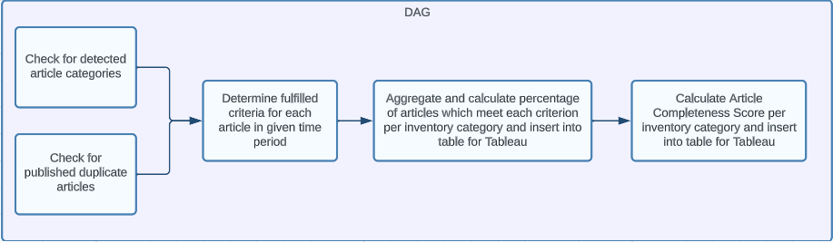

# Analytics Data Pipeline for News Aggregator with SQL + Airflow

### Scenario
Our objective is to create a series of scripts which will allow us to conduct a weekly and monthly analysis of online articles for a (fictional) online news aggregator and entertainment website called Camelot. In this scenario, Camelot collects articles from paying customers (in return for "premium" promotion on the Camelot news portal) as well as from other sources.

### Article Completeness Criteria:

The objective is to collect and track data on the extent to which articles meet certain criteria, which can impact their display and user engagement. These criteria include:

- length of article title is less than 120 characters (important because longer titles may get cut off in certain display formats)
- length of article content is greater than 3,000 and less than 15,000 characters
- article includes brief author bio
- article category was detected by in-house algorithms (important for searches within the Camelot portal)
- a reader rating is displayed (depends on the display format)
- article is prominently featured
- technical format is mobile friendly (important because some article formats are less suited for small screens)
- article has duplicates published at the same time (can happen because multiple methods are used for collecting articles)

The objective is to determine the number of postings which meet the above criteria on a weekly / monthly basis and loading the corresponding data into tables which can be used for a Tableau Dashboard. Furthermore, a "Score" is to be created which indicates the extent to which an article fulfills the above criteria. 

### Overview of solution: 

To get the data several SQL scripts were created, which can be run sequentially using Airflow. The first two scripts (beginning with 00) can be run in parallel or in random order. The subsequent scripts must be run in order. The same SQL scripts are used for both the weekly and monthly analysis. The related variables would be passed into the script by a Python script. The weekly script would run every Monday and the monthly script every first day of the month.

Scripts overview:
- 00 Check ontology tables to determine, for each article, whether article category was detected  
- 00 Check to see which articles have an identical author and article title (duplicate check)
- 01 For each article visible during the given time period, check whether it meets each of the article completeness criteria
- 02 Aggregate results according to categories (paid, not paid, all inventory) for each of the criteria. Our result is a table which indicates the percentage of articles in the given period which meeting each AC criterion.
- 03 Calculate Article Completeness score (AC score) for each posting and aggregate results according to categories (paid, not paid, all inventory). Our result is a table which indicates the mean and median AC score for the given period. 

Since all criteria are booleans, i.e. they are either met or not met, a simple score is created where each criterion met accounts for 1 point. An article that meets 5 out of 8 criteria thus receives 5/8 points.

### Conclusion and Next Steps
While this is a fictional scenario, it is based on my previous professional experiences. 
Possible next steps could include:
- ML Model creation to determine feature importance: an ML model could be created to predict article engagement (views, clicks, shares, etc.) based on the indicated criteria. This could involve:
  - creating a regression model and calculating adjusted r2, to determine the amount of variance which can be explained by the features
  - conducting a feature importance analysis, utilizing for example permutation feature importance and partial dependence plots, to determine the features that have the most significant impact
- DAG Optimization: in case it is decided to run the pipeline for an extended time period (for example longer than 2 months) it could be worthwhile to integrate automatic data article completeness checks in the Airflow DAG

